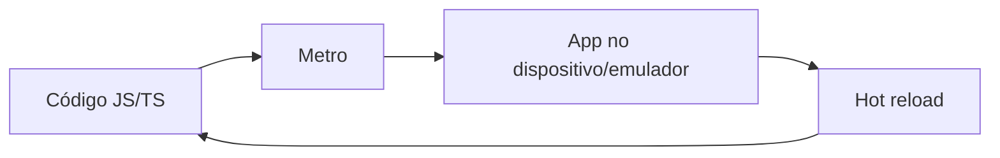

# Aula 01 – Introdução ao desenvolvimento mobile e ferramentas (Node, npm, npx)

**Sugestão de execução:** quinzena 1 (09/02/2026 a 20/02/2026).

**Base tecnológica:** Conceitos de dispositivos móveis e mercado; introdução ao desenvolvimento mobile; dispositivos móveis e o mercado; definição de dispositivos móveis; arquitetura de sistemas; principais plataformas; desenvolvimento Cross-Platform; desenvolvimento em blocos operacionais; ciclo de vida de um app.

---

## Objetivo da aula

Ao final você terá:
- Noção do que é desenvolvimento mobile e do mercado (Android, iOS, cross-platform).
- Node.js, npm e npx instalados e testados no seu computador.
- Entendimento do ciclo de vida de um app e do fluxo até o dispositivo/emulador.

Não vamos criar o app nesta aula; isso será na Aula 02. Aqui o foco é ambiente e conceitos.

---

## Parte 1 – Conceitos (leitura e discussão)

### O que é um dispositivo móvel (no nosso contexto)

- Smartphones e tablets com sistema operacional (Android, iOS).
- Apps rodam “em cima” do SO; acessam hardware (câmera, GPS, armazenamento) via APIs e permissões.

### Principais plataformas

- **Android:** maioria do mercado; desenvolvimento em Java/Kotlin (nativo) ou com frameworks.
- **iOS:** Apple; desenvolvimento em Swift/Objective-C (nativo) ou com frameworks.
- **Cross-Platform:** um código (ou quase) para as duas. Ex.: **React Native**, Flutter. Reduz esforço e mantém desempenho próximo do nativo.

### Ciclo de vida de um app (resumido)

1. **Desenvolvimento:** código (ex.: JavaScript/React) + recursos (imagens, textos).
2. **Build:** compilação/empacotamento para Android (APK/AAB) ou iOS (IPA).
3. **Execução:** app abre no dispositivo; pode ir para segundo plano (pause) e voltar (resume); ao fechar, encerra.
4. **Atualização:** nova versão; usuário ou loja atualiza.

No React Native com Expo, durante o desenvolvimento você usa um “servidor” (Metro) que envia o código para o app em tempo quase real (hot reload).

---

## Parte 2 – Instalar Node.js (necessário para npm e npx)

React Native e Expo usam **Node.js**. Node traz o **npm** (gerenciador de pacotes) e o **npx** (executor de pacotes).

### Passo 1 – Baixar Node.js

1. Acesse: [https://nodejs.org](https://nodejs.org).
2. Baixe a versão **LTS** (recomendada).
3. Execute o instalador e siga as opções padrão (inclua “Add to PATH” se aparecer).

### Passo 2 – Verificar instalação

Abra o **terminal** (PowerShell no Windows, Terminal no macOS/Linux) e rode:

```bash
node --version
```

Deve aparecer algo como `v20.x.x` ou `v22.x.x`.

```bash
npm --version
```

Deve aparecer algo como `10.x.x`.

```bash
npx --version
```

Deve aparecer um número de versão (o npx vem junto com o npm).

Se todos os comandos mostrarem versão, Node, npm e npx estão prontos.

### O que é cada um (resumo)

- **Node.js:** ambiente que executa JavaScript fora do navegador; usado por ferramentas de desenvolvimento (React Native, Metro, etc.).
- **npm:** instala e gerencia bibliotecas (pacotes) do ecossistema JavaScript. Comando típico: `npm install nome-do-pacote`.
- **npx:** executa um pacote sem instalar globalmente. Ex.: `npx create-expo-app@latest MeuApp` cria um projeto Expo sem instalar o `create-expo-app` de forma permanente.

---

## Parte 3 – Criar uma pasta para os projetos do ano

No terminal, escolha um lugar no seu computador (ex.: Área de trabalho ou Documentos) e crie uma pasta para o curso:

**Windows (PowerShell):**
```bash
cd $env:USERPROFILE\Desktop
mkdir PAM1-2026
cd PAM1-2026
```

**macOS/Linux:**
```bash
cd ~/Desktop
mkdir PAM1-2026
cd PAM1-2026
```

Não vamos criar o app nesta aula; na Aula 02 usaremos essa pasta com `npx create-expo-app@latest`.

---

## Parte 4 – Resumo do fluxo de desenvolvimento (React Native / Expo)



1. Você escreve código em JavaScript/TypeScript (componentes, telas).
2. O **Metro** (servidor de desenvolvimento) empacota e envia o código para o app.
3. O app roda no **emulador** ou no **celular** (via Expo Go).
4. Ao salvar o arquivo, o app atualiza (**hot reload**) sem precisar fechar e abrir de novo.

---

## Parte 5 – Checklist da Aula 01

Antes de considerar a aula concluída, confira:

- [ ] Entendeu o que é desenvolvimento mobile e cross-platform (React Native).
- [ ] Instalou o Node.js (versão LTS).
- [ ] Conferiu no terminal: `node --version`, `npm --version`, `npx --version`.
- [ ] Criou a pasta onde vai guardar os projetos (ex.: `PAM1-2026`).
- [ ] Leu o resumo do ciclo de vida do app e do fluxo Metro + dispositivo.

---

## Próxima aula

Na **Aula 02** você vai usar `npx create-expo-app@latest` para criar o primeiro projeto React Native (Expo), abrir no emulador ou no celular e exibir "Olá, Mobile!".
