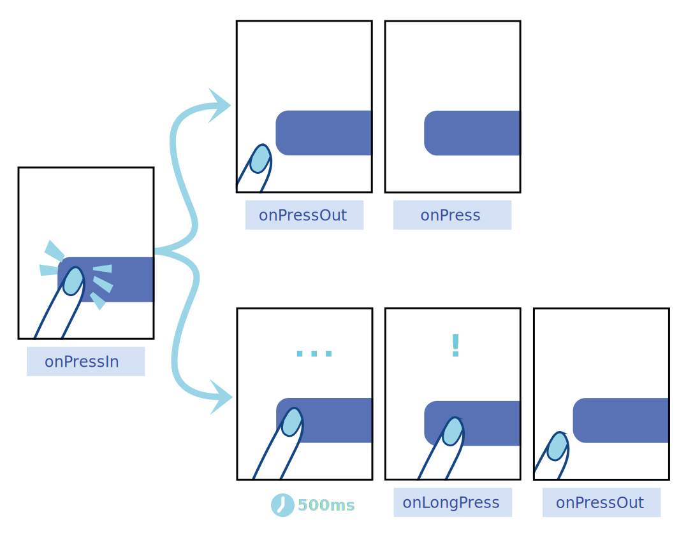

# Apresentação: O Poder Magnético do Toque ⚡

**Leitura Autônoma de Arquitetura de Interface**

Até o momento, criamos retângulos surdos e mudos. É hora de dar ouvidos e voz ao nosso aplicativo através da inserção de Componentes Textuais Dinâmicos e Sensores de Toque.

---

## 1. O Texto Sagrado (`<Text>`)
Se no desenvolvimento de sites HTML você escreve palavras soltas dentro de `<div>` ou `<span>`, e o navegador descobre e exibe o que fazer, aqui o mundo nativo pune a desorganização:
**No React Native, absolutamente NADA aparece escrito na tela se não estiver dentro de uma tag `<Text>`.**
Tentar escrever `Bem-Vindo` solto dentro de uma `<View>` fará o compilador do celular explodir.

### Estilização de Texto em Cascata
O interessante do React Native é que componentes `<Text>` propagam estilos.
Se você colocar um Text grande, e dentro dele outro Text, as propriedades (como negrito `fontWeight` e tamanho `fontSize`) herdam a estrutura PAI.

*Referência Externa (Guia Oficial):* [Typography no RN](https://reactnative.dev/docs/text)

## 2. A Evolução: Morre o *TouchableOpacity*, Nasce o *Pressable*

Por muitos anos, você deve ter ouvido desenvolvedores veteranos falarem sobre encapsular botões usando a tag `<TouchableOpacity>`. Ele foi útil. Mas a Web e os celulares evoluíram.

A resposta moderna da Meta/Facebook foi criar uma API (Componente) 100% nova chamada **`<Pressable>`**.

### Qual a vantagem do Pressable?
O Toque Humano não é um clique de mouse de chumbo, rápido e seco. Tocar em um vidro (Touchscreen) pode ser incrivelmente rico. O `<Pressable>` captura todo o ciclo de vida desse toque através de seus eventos:

1. **`onPressIn`**: Disparado no exato milissegundo em que o dedo encosta na tela. Ideal para iniciar uma animação de "botão sendo pressionado" ou mudar a cor de fundo.
2. **`onPressOut`**: Disparado quando o dedo é levantado da tela ou desliza para fora da área do botão. Útil para reverter o botão à sua forma original.
3. **`onPress`**: O clique tradicional. Disparado logo após o `onPressOut`, mas **apenas** se o usuário levantar o dedo ainda dentro da área do botão.
4. **`onLongPress`**: Disparado quando o dedo é mantido na tela por um tempo (geralmente acima de 500ms). Muito usado para ações extras, como abrir menus de contexto (ex: segurar uma mensagem no WhatsApp para responder).



**Exemplo Prático de Uso dos Eventos:**

```tsx
<Pressable
  onPressIn={() => console.log('👆 Dedo encostou!')}
  onPressOut={() => console.log('👋 Dedo saiu ou levantou!')}
  onPress={() => console.log('✅ Clique confirmado!')}
  onLongPress={() => console.log('⏱️ Pressionamento longo detectado!')}
>
  <Text>Interaja Comigo!</Text>
</Pressable>
```

Além de capturar toda essa riqueza de eventos, o `<Pressable>` permite estilização condicional automática e traz o famoso fator `Hit Slop`, que expande invisivelmente a área clicável do componente, garantindo que usuários acertem os botões com facilidade, sem sacrificar o design e melhorando a acessibilidade!

👉 [Estudo Profundo na Documentação Oficial: API The Pressable](https://reactnative.dev/docs/pressable)

## 3. O Paradigma de Estilização em Arrays

No Tutorial Prático dessa aula nós faremos uma técnica visual insana de **Merge de Estilos**.
Se você tem dois botões (Amarelo e Azul), você não cria "BotaoAmarelo.tsx" e "BotaoAzul.tsx".
Você cria apenas um `Button.tsx`.

E com a magia das chaves em JavaScript, aplicamos dois `StyleSheets` ao mesmo tempo usando chaves Quadradas: `style={ [ styles.botaoPadrão, styles.botaoAzul ] }`. O sistema vai somar os dois estilos. 
Isso permite criar aplicativos com Temas Brancos e Claros extremamente modulares.

Vá para o Guia Prático! O StickerSmash o aguarda.
