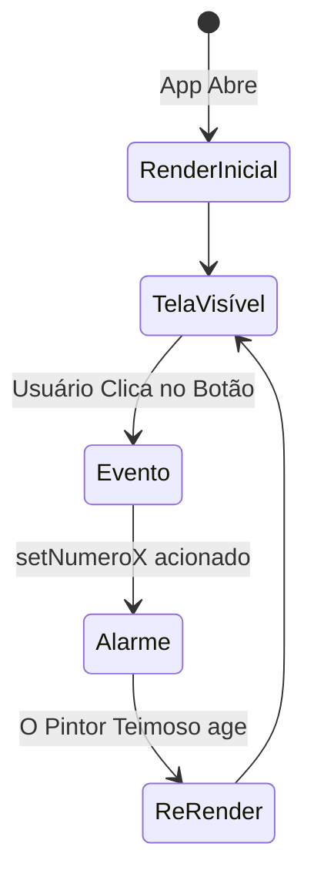

# Apresentação: O Pintor Imutável e o Guarda Invisível 🧠

**Leitura Autônoma de Engenharia Front-End (Render Lifecycle)**

Até hoje, quando precisávamos alterar algo, deixávamos instruções subentendidas e o React magicamente lidava. Hoje, nós abrimos o capô do carro. Você vai entender a *Árvore de Renderização* através de duas metáforas industriais.

---

## 1. O Pintor Teimoso e a Tinta Imutável (`useState`)
Imagine que o Celular seja uma tela em branco gigante e o React seja um "Pintor Genial, porém Autista".
Você entrega pra ele uma variável bruta `numeroX = 1`. Ele pinta o botão de azul.
Se você pegar o JavaScript por trás das costas dele e fizer `numeroX = 2`, o Pintor **não está nem aí para você**. Ele se recusa a olhar para o botão e pintá-lo de vermelho!

Por quê? Porque a memória de V8 é veloz e ignorante. Nós não mudamos variáveis cruas.
Nós precisamos usar a função **`setNumeroX(2)`** (o nosso Hook `useState`).
Quando você clica no `Set`, você aciona um sino gigantesco na cabeça do "Pintor Teimoso". O Set berra: *"A TINTA AGORA É A 2! DESTRUA O QUADRO ANTIGO E REPINTE-O DA ESTACA ZERO"*. Em 15 milissegundos o celular recria todo a interface gráfica usando as informações atualizadas. Chamamos isso de **Imutabilidade** da Memória de Estado.

**Exemplo Prático: Um Contador Simples**
```tsx
import { useState } from 'react';
import { View, Text, Button } from 'react-native';

export default function Contador() {
  // [Variável de Leitura, Função de Escrita] = Valor Inicial
  const [cliques, setCliques] = useState(0); 

  return (
    <View>
      <Text>Você clicou {cliques} vezes!</Text>
      <Button 
        title="Me Aperte" 
        onPress={() => setCliques(cliques + 1)} // 👈 Avisa o pintor!
      />
    </View>
  );
}
```



## 2. A Ilusão do Array `.push` e o Terror Invisível
Pessoas novatas frequentemente querem adicionar um novo usuário numa lista usando o clássico empurrão do Array:
```js
minhaListaDeAlunos.push("Jack") 
```
No React, **Se você tentar usar `.push`, O aplicativo não via reagir ou irá Crasha**r. 
O Javascript até empilha no aray silenciosamente por de trás das cortinas, mas o Pintor Teimoso `SeTheHook` exige que a referência hexadecimal do vetor mude.

Seja Ninja. Use Cópia Limpa e Destrutiva do novo padrão Spread (*...*).
```js
setLista( [...listaVelha, "Novo Cara Legal"] )
```
Isso literalmente clona os 50 ítens velhos, enfia o novo, e cria na RAM um Clone Imutável perfeito, disparando os sinos do repintor na hora!

## 3. O Guarda Noturno (`useEffect`)
Se nós mandarmos o React recarregar do banco de dados os amigos online dele direto na Tela... sabe o que acontecerá? O Pintor desenha a tela > Aciona o Banco > Como o painel mudou ele chama ele mesmo para Repintar de novo > O que aciona o banco de dados de novo...
O App entraria no famigerado Loop Infinito que frita baterias.

O **`useEffect`** é o nosso Guarda Noturno. Ele vive numa cabine isolada `[]`.
Sua regra suprema: **"Eu, O Guarda Noturno, SÓ TRABALHO 1 ÚNICA VEZ, NA EXATA HORA QUE O USUÁRIO ABRIR ESSA TELA"**.
* Ninguém entra e sai do banco de dados na minha área sem a minha bênção. Nós agendamos os carregamentos mais caros e lentos dentro da cabine segura do `useEffect` para que ele só rode quando tiver certeza absoluta que tudo está pacífico no sistema operacional.

**Exemplo Prático: O Guarda Noturno em Ação**
```tsx
import { useEffect, useState } from 'react';
import { View, Text } from 'react-native';

export default function TelaPerfil() {
  const [status, setStatus] = useState("Carregando...");

  // O useEffect roda IMEDIATAMENTE após a tela ser desenhada pela 1ª vez
  useEffect(() => {
    console.log("Guarda Noturno Acionado: Fui no banco de dados!");
    // Simulando uma ida lenta ao banco...
    setTimeout(() => {
      setStatus("Carregamento 100% Concluído!");
    }, 2000);
  }, []); // 👈 A "cabine segura": Array vazio significa "rode APENAS UMA ÚNICA VEZ na vida desta tela"

  return (
    <View><Text>{status}</Text></View>
  );
}
```


👉 **Expanda sua Cabeça Estudando a Documentação Base:** [A Mente: Hooks no React](https://react.dev/reference/react)
