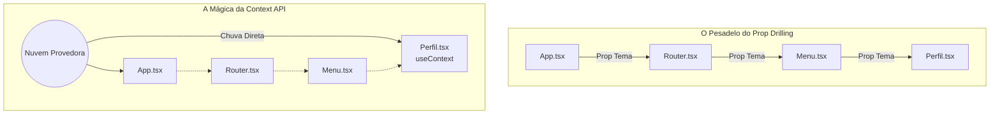

# Apresentação: O Prop Drilling e a Context API 🌐

**Leitura Autônoma de Engenharia Front-End Avançada**

A gestão de Estado Global é a prova de fogo que separa o programador de cursos online básicos do Arquiteto Mobile Real.

---

## 1. O Problema "Prop Drilling" (A Furação de Poços)
Se uma Variável (Nome do usuário online) viver no Cérebro do `App.tsx`, e a tela do Menu Inferior do Perfil 10 pastas abaixo na arquitetura Router precisar saber esse Nome... Você teria que criar "Props" no App.tsx e enviar para Router.tsx. O Router enviaria de Prop pro Menu.tsx. E O Menu enviaria de Prop pro Perfil.tsx.

Essa corrente burocrática bizarra para descer a hierarquia se chama **Prop Drilling**.
Isso suja todo o seu código intermediário com variáveis que não pertencem a eles.

## 2. A Nuvem (O Context API)
Para resolver a furação, o React Nativo criou o Padrão do Contexto Mágico de três passos:

- **Passo 1 (`createContext`):** Você molda a "Nuvem". Você cria um Arquivo externo solitário dizendo: *"Eu declaro um buraco atemporal e espacial nesta dimensão. Ele abrigará a variável chamada Tema".*
- **Passo 2 (`Provider`):** Se a Nuvem chove, ela só molha quem estiver debaixo dela certo? Você envolve Todo o seu aplicativo-raiz (Logo as engrenagens de _layout do Expo Router, ou o NavigationContainer) dentro do Abraço Paterno do `MeuContexto.Provider`. Isso faz a mágica abranger todo mundo.
- **Passo 3 (`useContext`):** Agora, qualquer component de botão minúsculo escondido no último buraco de seu App pode gritar `useContext(Tema)` e instantâneamente sugar/apontar pra nuvem central puxando ou repintando o quadro!



**Exemplo Prático: Criando e Bebendo da Nuvem**
```tsx
import { createContext, useContext, useState } from 'react';
import { View, Text, Button } from 'react-native';

// PASSO 1: A Nuvem
const NuvemTema = createContext("claro"); 

// PASSO 2: O Provedor (Envolva seu App com ele)
function App() {
  const [temaGlobal, setTemaGlobal] = useState("escuro");

  return (
    <NuvemTema.Provider value={temaGlobal}>
      <MinhaTelaProfunda />
    </NuvemTema.Provider>
  );
}

// PASSO 3: O Consumidor (Onde quer que ele esteja)
function MinhaTelaProfunda() {
  const temaAtual = useContext(NuvemTema); // 👈 Sugando da Nuvem
  return <Text>O mundo lá fora está: {temaAtual}</Text>;
}
```


## 3. Desafio Frequente de Engenharia: A Otimização
Toda vez que uma variável dentro da Context API chove (Um Dev mudou para Modo Escuro), **todas as telas que estavam bebendo daquela nuvem recarregam**. Se você colocar um cronômetro de milissegundos num Context global, e 50 telas lerem, seu celular frita.

Para blindar repaints caros, empresas usam `useCallback` e `useMemo`.
Eles dizem para a Nuvem: *Guarde o calculo de impostos desse carro blindado na memória forte e só recarregue o Front-End se a placa do carro mudar.*
Por hoje, nos focaremos em apenas arquitetar nosso primeiro Provider universal no celular!

👉 **Expanda sua Cabeça Estudando a Documentação Base:** [A Matrix: Context API Oficial](https://react.dev/reference/react/createContext)
