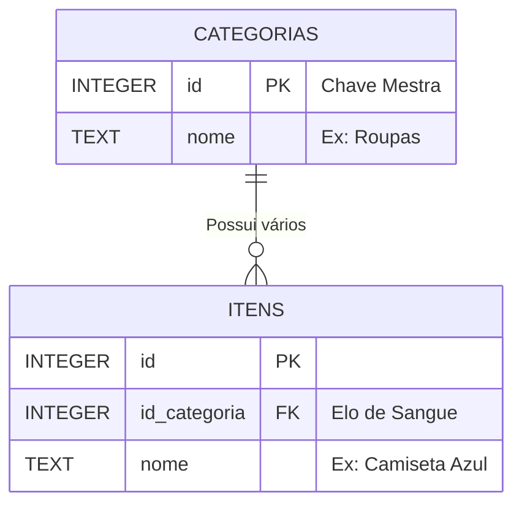

# Apresentação: Cruzando as Fronteiras 🖇️

**Leitura Autônoma de Engenharia de Banco de Dados**

Um Dev júnior puxa todos os Carrinhos de Compra do Banco, usa um `Loop For` em JavaScript e, para cada carrinho, dispara um novo `SELECT` em Categoria para achar o nome. Resultado? Ele disparou Mil Seleções travando a renderização gráfica do Frontend com Gargalo de Processamento de IO. 
Seu chefe te demitiria por isso.

---

## 1. O INNER JOIN (O Nó de Sangue)
Qual a solução do sênior? Faça o Motor Primitivo do C++ do Banco fazer a conta em Milissegundos e lhe devolver um único array pronto com ambas as matérias grudadas.

Para fazer isso usamos a Palavra `JOIN`. Ela gruda a `Tabela A` na `Tabela B` de lado. Mas o SQLite é Burro, ele precisa de uma Condição Suprema para grudar os bloquinhos do Lego:

**A condição de Junção (ON).**
Você diz ao motor: "Cruze a tabela ITENS com a CATEGORIAS. Como? Se o `id_categoria` do Item BATER IGUALZINHO (=) com a Chave Mestra `id` das Categorias."
BOOM. A Matriz retorna casada perfeitamente. Todos os produtos estão colados com os seus respectivos e literais nomes de categoria ao invés de ids cegos.



## 2. Alias de Nomenclaturas (Apelidos)
Ao juntar duas coisas, teremos 2 colunas com nome de "ID" grudadas, e 2 colunas com o nome "Nome", a do sapato e a da categoria... Isso causa Crash de Sobreposição.
Para não bagunçar, usamos os "Apelidos" de Letras e extraímos as palavras chaves separando os clones (`AS`):
```sql
-- "i" = Sigla boba para itens. "c" = sigla para categorias.
SELECT i.nome, c.nome AS nome_categoria_fantasia 
```

## 3. O Paradoxo da Deleção Relacional
O JOIN exige perfeição e dependência de "Pai e Filho". Se eu apagar a Categoria Master "E-books" que possuía 50 e-book itens dentro dela... e meus itens ficarem salvos com a Foreign Key `id:45` que não puxa pra lugar nenhum pois o pai sumiu? Temos um banco quebrado de Dados Fofos Órfãos.
Para defender isso, Arquitetos travam deleções.
Ou **Vocễ deleta todas os Filhos primeiro (Cascading Delete)**, ou bota um Aviso Vermelho explodindo pro usuário: *"Não posso excluir PAI que possui Filhos amarrados... Limpe-os antes!"*

👉 **Expanda sua Cabeça Estudando a Documentação Base:** [O Mestre Padrão INNER JOIN SQL](https://www.w3schools.com/sql/sql_join.asp)
