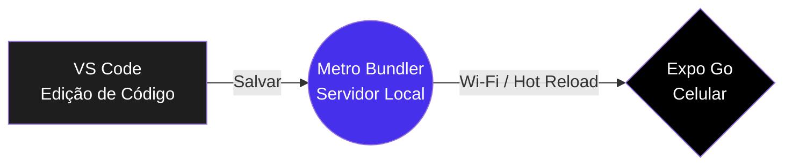

# Apresentação: O Universo Mobile 📱

**Sugestão de uso:** slides da Aula 01 (leia em voz alta, ou leia sozinho antes do tutorial).

---

## 1. Bem-vindo à Fronteira

A internet mudou, e o mundo não mora mais atrás de mesas com teclados e mouses gigantes. Ele está nos **bolsos das pessoas**.

O desenvolvimento Mobile é a arte de colocar ferramentas vitais, entretenimento e vida financeira na ponta dos dedos de bilhões de usuários. Todo app que você usa no celular foi criado por alguém que um dia também começou do zero.

> [!NOTE]
> **Curiosidade:** mais de 5 bilhões de pessoas no mundo usam um smartphone. O celular é o computador que quase todo mundo tem.

---

## 2. A Guerra das Plataformas (e o Tratado de Paz)

Historicamente, criar um aplicativo era um inferno burocrático:

- Você precisava aprender **Java ou Kotlin** para atingir usuários de **Android**.
- Depois precisava começar do zero, mudando a mentalidade para **Swift**, se quisesse atingir os usuários da **Apple (iOS)**.

Isso **dobrava o custo** das empresas: duas linguagens, duas equipes, dois apps para manter.

Então o Facebook (atual Meta) soltou uma bomba benevolente no mercado: o **React Native**.

> [!IMPORTANT]
> **O que é o React Native?**
> É o "tratado de paz" entre Android e iOS. É a ponte mágica (**cross-platform** = multiplataforma) que permite escrever **um único código** em JavaScript e ele é traduzido em componentes nativos de alta performance **para Android e iOS ao mesmo tempo**.

---

## 3. Quem faz as coisas girarem? (A Trindade)

Para usar esse poder do React Native, você não constrói a betoneira — você a usa. Eis as **três ferramentas** que morarão no seu computador de agora em diante:

| Ferramenta | Analogia | Papel real |
|------------|----------|------------|
| **Node.js** | O fogão | Motor que roda JavaScript fora do navegador |
| **npm** | O shopping de temperos | Loja de bibliotecas prontas para baixar |
| **npx** | O iFood | Executa um pacote uma vez e some, sem sujeira |

> [!TIP]
> **Regra de ouro para lembrar:**
> - **npm** = *instalar e guardar* no projeto.
> - **npx** = *usar e descartar*.
>
> Quando um tutorial disser `npm install`, pense "comprei e guardei na dispensa". Quando disser `npx`, pense "pedi uma pizza".

---

## 4. O Ciclo de Vida: Nascer, Morrer e Dormir (Background)

A diferença principal entre um **App** e um **Site** é que o app é **vivo**:

- O sistema operacional do celular pode **minimizar** o app.
- Pode **fechar** ele quando a bateria está acabando.
- Ou pode deixá-lo **acordado**, escutando seu GPS em segundo plano.

Você verá isso na prática na Aula 09 (geolocalização) e na Aula 10 (notificações).

Neste curso, você terá um aliado chamado **Expo**: ele é o seu co-piloto, permitindo ver tudo que você digita recarregando magicamente em ~1 segundo no seu **celular real**, usando o famoso **Hot Reload**.

> [!NOTE]
> O diagrama mostra a mágica que você verá na Aula 02: você salva o código no computador, o **Metro Bundler** entrega a novidade, e o celular atualiza sozinho. Nenhum cabo, nenhum botão de "recompilar".

---

## 5. Para onde vamos agora?

Na próxima parada (o **Tutorial Prático**), vamos montar juntos esse ecossistema: instalar o Node, conferir as versões e criar a pasta do curso.

> [!TIP]
> Se você está assistindo em sala, abra o [tutorial.md](tutorial.md) e vamos fazer passo a passo. O professor pode ir avançando os slides enquanto você acompanha no computador.
