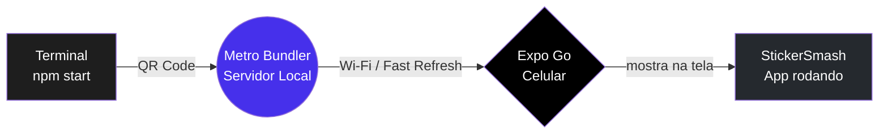

# Apresentação: O Big Bang do seu App 💥

**Sugestão de uso:** slides da Aula 02 (leia em voz alta, ou leia sozinho antes do tutorial).
**Data:** 23/02/2026

---

## 1. A Ferramenta de Criação Universal

Lembra do `npx` da primeira aula? Aquele **iFood virtual** que baixa um pacote, usa e vai embora?

Hoje vamos acioná-lo para encomendar o `create-expo-app`. Ele é um **robô-pedreiro gigante**, que em minutos:

- Baixa para você as **pontes nativas** do Google (Android) e da Apple (iOS);
- Configura o **Babel** (um tradutor de código moderno);
- Junta o **React**;
- E monta uma **estrutura de pastas** completa para o app funcionar.

Você não constrói a betoneira — você chama o robô. E ele entrega a obra pronta.

> [!NOTE]
> **De onde saiu isso tudo?** Na Aula 01 você aprendeu que `npx` é o "entregador de aplicativos". Hoje ele faz a entrega mais importante do curso: um projeto **Expo** inteiro, com tudo que um app precisa para rodar em celulares reais.

> [!TIP]
> O comando `npx create-expo-app@latest StickerSmash` faz a obra em **~2 minutos**. É a mesma "mágica" que empresas usam para começar apps novos todos os dias.

---

## 2. A Anatomia do que Acabou de Nascer

O robô criou o projeto, mas o arquiteto (você!) precisa conhecer os **três guardiões** da obra:

### `node_modules` — O Buraco Negro

Lá dentro moram **milhares de pastas** de bibliotecas de terceiros (ícones, o próprio React, etc.).

> [!IMPORTANT]
> **Regra de Ouro: nunca entre no `node_modules`. Nunca edite nada dentro dele. Respeite o selo.** 🔒 Aquilo é área de serviço de terceiros — mexe e quebra tudo.

### `app.json` — A Certidão de Nascimento

É o documento oficial do seu app. Nele você define:

- a **cor padrão** de fundo;
- se a tela fica **travada em pé** ou pode deitar;
- o **Nome Oficial** que aparece nas lojas;
- o **ícone** (a "fotinha mágica" do celular).

### `/app` — A Pasta Principal

Antigamente os projetos tinham um único arquivo `App.js`. Hoje, o Expo usa o poderoso **Expo Router**:

> [!TIP]
> **Cada arquivo `.tsx` que você criar dentro da pasta `app/` vira uma tela do celular automaticamente.** A primeira tela é o sagrado `index.tsx`, e o `_layout.tsx` é o esqueleto de navegação (o maquinista — conhecemos ele bem na Aula 06).

O template padrão do Expo já nasce com um **exemplo de demonstração**. Por isso rodamos `npm run reset-project` no tutorial: para limpar e ficar só com `app/index.tsx` e `app/_layout.tsx`.

> [!CAUTION]
> O `npm run reset-project` **apaga o código de exemplo**. Não é perigoso — você vai escrever tudo do zero do seu jeito. Apenas responda **n** à pergunta dele (quem guarda cópia desnecessária perde tempo).

---

## 3. Expo Go (Sua Televisão ao vivo)

Você não precisa de um supercomputador para criar apps. Seu celular de bolso tem hardware **dezenas de vezes mais potente** que as cápsulas que foram à Lua. 🚀 Basta baixar o app **Expo Go** (Play Store ou App Store).

Veja o ciclo da mágica:

Quando você executa `npm start`, o **Metro Bundler** acende uma antena. O aplicativo **Expo Go** do celular pega o sinal (pelo Wi-Fi), puxa seu código para a **memória RAM** do smartphone e compila a tela na hora.

> [!NOTE]
> O Expo Go é como uma **televisão ao vivo**: ele não guarda o app, apenas recebe o sinal e mostra. Toda vez que você salva o código, o **Fast Refresh** entrega a novidade em ~1 segundo — sem cabos, sem botão de "recompilar".

> [!WARNING]
> **(E se o Wi-Fi da escola bloquear?)** Calma, temos um salvador: no tutorial configuramos o `--tunnel` no `package.json`. Ele cria uma **URL pública temporária** que fura o bloqueio do firewall/proxy — seu celular carrega o app até pelo 4G! Se o terminal travar com o `--tunnel`, o [Guia de Erros Comuns](../../docs/GUIA-DE-ERROS-COMUNS.md) tem o plano B (instalar o `ngrok` na unha ou rodar via **cabo USB**).

---

## 4. Para onde vamos agora?

Fechamos a teoria — agora é mão na massa. No tutorial você vai:

1. Criar o **StickerSmash** com `create-expo-app`;
2. Limpar o exemplo com `npm run reset-project`;
3. Furar o bloqueio da rede com o `--tunnel`;
4. Escurecer a tela com `View`, `Text` e `StyleSheet`.

> [!TIP]
> Se você está assistindo em sala, abra o [tutorial.md](tutorial.md) e vamos fazer passo a passo. O professor pode ir avançando os slides enquanto você acompanha no computador. No final da aula, seu próprio app estará **vivo no seu celular**. 🎉
