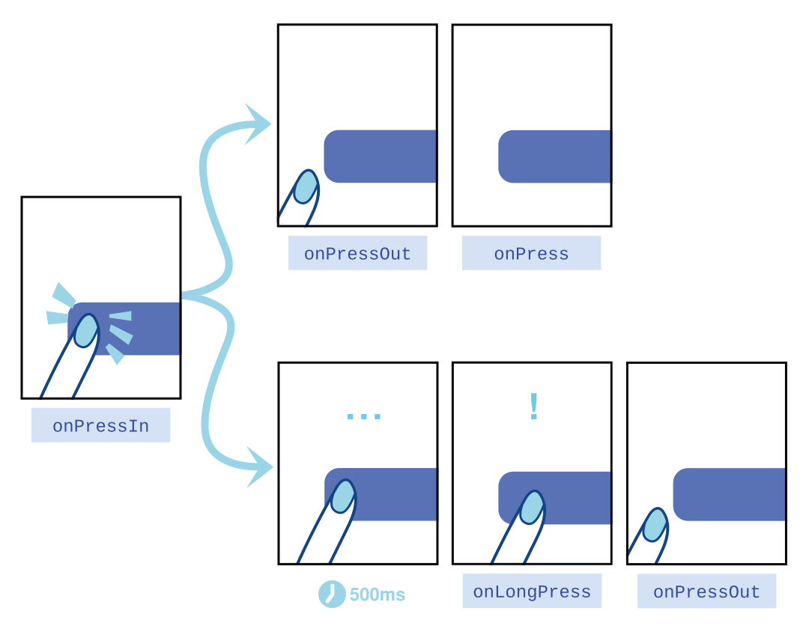

# Apresentação: O Poder Magnético do Toque ⚡

**Sugestão de uso:** slides da Aula 04 (leia em voz alta, ou leia sozinho antes do tutorial).

Até aqui criamos retângulos "surdos e mudos". É hora de dar **ouvidos e voz** ao nosso aplicativo através de componentes textuais dinâmicos e sensores de toque.

---

## 1. O Texto Sagrado (`<Text>`)

Na web, você escreve palavras soltas dentro de `<div>` ou `<span>` e o navegador descobre o que mostrar. No mundo nativo, a bagunça é punida:

> [!IMPORTANT]
> **No React Native, absolutamente NADA aparece escrito na tela se não estiver dentro de uma tag `<Text>`.** Tentar escrever `Bem-Vindo` solto dentro de uma `<View>` fará o código dar erro.

### Estilização de Texto em Cascata

O interessante é que os `<Text>` **propagam estilos** de pai para filho. Se você coloca um `<Text>` grande e, dentro dele, outro `<Text>`, as propriedades como negrito (`fontWeight`) e tamanho (`fontSize`) são **herdadas** da estrutura do pai.

> [!NOTE]
> Referência oficial: [Tipografia no React Native](https://reactnative.dev/docs/text)

---

## 2. A Evolução: Morre o *TouchableOpacity*, Nasce o *Pressable*

Por muitos anos, os devs veteranos encapsulavam botões usando `<TouchableOpacity>`. Ele foi útil. Mas a web e os celulares evoluíram.

A resposta moderna foi criar uma API (componente) nova chamada **`<Pressable>`**.

### Qual a vantagem do Pressable?

O toque humano não é um clique de mouse seco e rápido. Tocar num vidro (*touchscreen*) é rico em detalhes. O `<Pressable>` captura todo o **ciclo de vida** do toque através dos seus eventos:

| Evento | Quando dispara | Para que serve |
|--------|----------------|----------------|
| **`onPressIn`** | No exato milissegundo em que o dedo **encosta** na tela | Iniciar uma animação de "botão sendo pressionado" ou mudar a cor de fundo |
| **`onPressOut`** | Quando o dedo **é levantado** ou desliza para fora do botão | Reverter o botão à forma original |
| **`onPress`** | Logo após o `onPressOut`, mas **apenas** se o dedo levantou **dentro** do botão | O "clique tradicional" |
| **`onLongPress`** | Quando o dedo é **mantido** por um tempo (geralmente +500ms) | Ações extras, como abrir um menu (ex.: segurar a mensagem no WhatsApp) |



> [!NOTE]
> O desenho acima mostra os momentos do toque: encostar, segurar, levantar. Cada um deles pode disparar uma função diferente — e é isso que torna o app "vivo".

**Exemplo Prático de Uso dos Eventos:**

```tsx
<Pressable
  onPressIn={() => console.log('👆 Dedo encostou!')}
  onPressOut={() => console.log('👋 Dedo saiu ou levantou!')}
  onPress={() => console.log('✅ Clique confirmado!')}
  onLongPress={() => console.log('⏱️ Pressionamento longo detectado!')}
>
  <Text>Interaja Comigo!</Text>
</Pressable>
```

Além de capturar essa riqueza de eventos, o `<Pressable>` permite **estilização condicional automática** e traz o famoso **Hit Slop**: ele expande *invisivelmente* a área clicável do botão, garantindo que os usuários acertem o toque com facilidade — sem sacrificar o design e melhorando a acessibilidade!

> [!TIP]
> Estudo profundo na documentação oficial: [API The Pressable](https://reactnative.dev/docs/pressable)

---

## 3. O Paradigma de Estilização em Arrays

No Tutorial dessa aula faremos uma técnica visual chamada **Merge de Estilos** (fusão de estilos).

Se você tem dois botões (amarelo e azul), você **não** cria `BotaoAmarelo.tsx` e `BotaoAzul.tsx`. Você cria apenas **um** `Button.tsx`.

E, com a magia das chaves do JavaScript, aplicamos **dois** `StyleSheet` ao mesmo tempo usando colchetes:

```tsx
style={[styles.botaoPadrao, styles.botaoAzul]}
```

O sistema vai **somar** os dois estilos: o base de todos os botões + o extra que só o botão azul tem.

> [!IMPORTANT]
> **Merge de estilos** = juntar dois estilos num só usando `style={[estiloA, estiloB]}`. Se o estilo B repetir uma propriedade do A, o B "vence" por vir depois. Isso permite criar temas (claro/escuro, primário/secundário) de forma modular.

Vá para o Guia Prático! O StickerSmash o aguarda. 🚀
