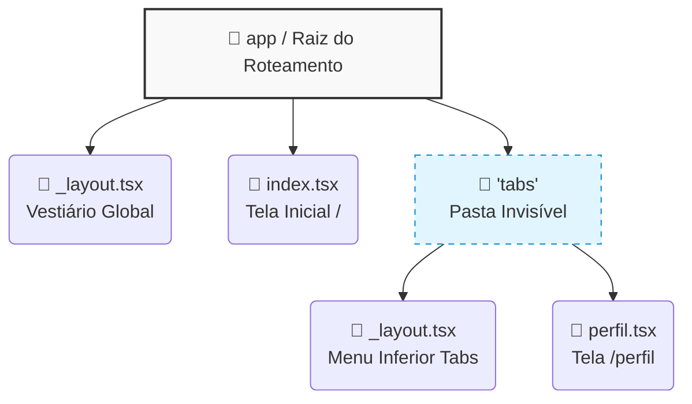

# Apresentação: O Roteamento Dinâmico (Expo Router)

**Sugestão de uso:** slides da Aula 06 (leia em voz alta antes do tutorial).

---

## 1. File-Based Routing: o Nome do Arquivo Vira Rota

Até poucos anos atrás, programadores de React Native tinham que escrever várias linhas de código para configurar a navegação entre telas. Hoje, o **Expo Router** faz isso de forma automática.

A mágica é simples: a pasta `/app` do seu projeto é vigiada por um "maquinista silencioso". Se você criar um arquivo chamado `perfil.tsx` dentro dela e exportar uma função React, o Expo Router **automaticamente** gera uma rota chamada `/perfil`. Sem configurar nada.

Pense assim: na cozinha que você montou nas aulas anteriores, cada arquivo é uma "receita". O Expo Router é o cardápio que mostra todas as receitas disponíveis — você só precisa nomear os arquivos direito.

> [!NOTE]
> **File-Based Routing** significa "roteamento baseado em arquivos". O nome do arquivo = o caminho da tela. Crie `configuracoes.tsx` → rota `/configuracoes`. Simples assim.

---

## 2. A Casca da Cebola: os `_layout.tsx`

Aqui vem o segundo segredo supremo. Telas soltas criadas direto na pasta `/app` ficam "peladas" — sem cabeçalho, sem menu, sem nada. Elas batem direto nas bordas da tela do celular.

É aí que entra o arquivo especial chamado **`_layout.tsx`**. Toda vez que você coloca um arquivo com underline `_` no começo do nome dentro de uma pasta, o Expo Router intercepta tudo.

Em vez de mostrar as telas cruas, ele as "veste" com o que estiver escrito no `_layout.tsx`:

- **Layout tipo `Stack`:** as telas são empilhadas umas sobre as outras, como pilha de pratos. Aparece automaticamente a "setinha de voltar" no cabeçalho.
- **Layout tipo `Tabs`:** aparece um menu inferior com ícones, igual o Instagram ou o WhatsApp.

> [!IMPORTANT]
> O arquivo `_layout.tsx` é o "cérebro" de cada pasta. Ele define **como** as telas daquela pasta vão se comportar. Sem ele, as telas funcionam, mas ficam sem identidade.

---

## 3. Parênteses Invisíveis: o Grupo Lógico `(tabs)`

A última mágica de hoje: no Expo Router, se você der o nome de uma pasta com parênteses — por exemplo, `(tabs)` — o Router **desconsidera o nome da pasta** e lê direto o nome dos arquivos de dentro.

Isso é fenomenal porque permite separar as telas principais (do menu inferior) das telas secundárias (como login ou configurações) sem estragar o endereço do app.

**Exemplo: a estrutura de arquivos**



**Código de um `_layout.tsx` de Abas (Tabs):**

```tsx

import { Tabs } from 'expo-router';

export default function LayoutDasAbas() {
  return (
    <Tabs>
      <Tabs.Screen
        name="index"
        options={{ title: 'Início', tabBarIcon: () => <IconHome /> }}
      />
      <Tabs.Screen
        name="perfil"
        options={{ title: 'Meu Perfil', tabBarIcon: () => <IconUser /> }}
      />
    </Tabs>
  );
}

```

> [!NOTE]
> Repare que `<Tabs.Screen>` tem uma prop `name`. Esse `name` deve ser **exatamente** o nome do arquivo da tela (sem a extensão `.tsx`). Se o arquivo se chama `index.tsx`, o `name` é `"index"`.

---

## 4. Resumo Visual

| Conceito | Analogia | O que faz |
|----------|----------|-----------|
| **Expo Router** | O GPS do app | Cria rotas automaticamente a partir dos arquivos |
| **`_layout.tsx`** | O uniforme do garçom | Veste todas as telas da pasta com estilo |
| **`Stack`** | Pilha de pratos | Empilha telas, botão "voltar" automático |
| **`Tabs`** | Menu inferior | Mostra abas com ícones no rodapé |
| **`(tabs)`** | Sala reservada | Agrupa telas sem aparecer no endereço |

> [!TIP]
> Quer se aprofundar? Leia a documentação oficial: [A Mágica do Expo Router](https://docs.expo.dev/router/introduction/)
