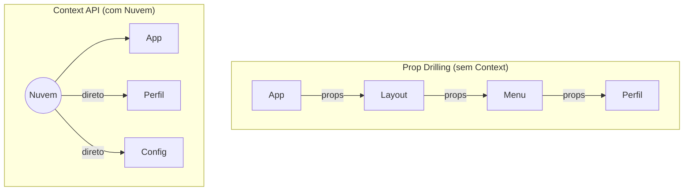

# Apresentação: Prop Drilling e a Context API 🌐

**Sugestão de uso:** slides da Aula 12 (leia em voz alta antes do tutorial).

---

## 1. O Problema: A Escada Infinita (Prop Drilling)

Imagine que o tema do app (claro/escuro) está guardado no componente raiz. Mas a Tela "Configurações" fica **5 pastas abaixo** na navegação. Como você passa esse dado até lá?

A resposta "ingênua" é enviar via **props** de componente em componente:

```
App.tsx → props.tema → Layout.tsx → props.tema → Menu.tsx → props.tema → Perfil.tsx
```

Isso se chama **Prop Drilling** — e é um pesadelo. Você acaba sujando componentes intermediários com variáveis que não dizem respeito a eles.

> [!NOTE]
> **O que são "props"?** Props são como parâmetros de função — dados que um componente pai "empurra" para o componente filho. Funciona bem para 1 ou 2 níveis. Mas para 5, 10 níveis? É tortura.

---

## 2. A Solução: A Nuvem (Context API)

A **Context API** cria uma "nuvem" de dados global. Qualquer componente, por mais fundo que esteja, pode "beber" dessa nuvem diretamente — sem precisar que o pai passe nada.

Funciona em 3 passos:

### Passo 1: Criar a nuvem (`createContext`)

```tsx
const TemaContext = createContext("claro");
```

Isso cria um "buraco" onde os dados vão morar. É como criar um link compartilhado no Google Drive — o link existe, mas ainda não tem arquivo dentro.

### Passo 2: Envolver o app com o Provider

```tsx
<TemaContext.Provider value={temaGlobal}>
  <SuasTelasAqui />
</TemaContext.Provider>
```

O **Provider** é como um guarda-chuva que cobre todas as telas. Quem está debaixo dele tem acesso à nuvem.

### Passo 3: Beber da nuvem (`useContext`)

Em qualquer tela, por mais profunda que seja:

```tsx
const temaAtual = useContext(TemaContext);
```

Pronto. Sem props, sem escada, sem dor de cabeça.

> [!IMPORTANT]
> **Analogia da pizzaria:** imagine que o Provider é a mesa com a caixa de pizzas aberta. O `useContext` é a mão que pega uma fatia. Qualquer pessoa na mesa pode pegar — não precisa que o garçom (o componente pai) repasse a pizza fatia por fatia.

---

## 3. Cuidado: Toda Nuvem Recarrega as Telas

Quando uma variável dentro da Context API muda (ex.: o tema trocou), **todas** as telas que estavam "bebendo" dela são redesenhadas. Se você tiver 50 telas lendo o mesmo contexto, todas vão repintar.

> [!WARNING]
> Por isso, Context API é ideal para dados **poucos e estáveis** (tema, usuário logado, idioma). Para dados que mudam a cada milissegundo (cronômetro, contagem em tempo real), use `useState` local ou bibliotecas especializadas.

---

## Resumo Visual



---

## Como isso se aplica ao seu projeto

- **Tema do app:** usuário escolhe claro/escuro → `TemaContext` aplica em todas as telas
- **Categoria 1 (Tarefas):** contexto de "tarefas" torna a lista acessível na Home e nos Detalhes
- **Categoria 4 (Gastos):** contexto de "categoria selecionada" filtra sem recarregar do banco

> [!TIP]
> Para se aprofundar, consulte a [documentação oficial da Context API](https://react.dev/reference/react/createContext). Lá tem exemplos interativos que mostram a "nuvem" em ação.
